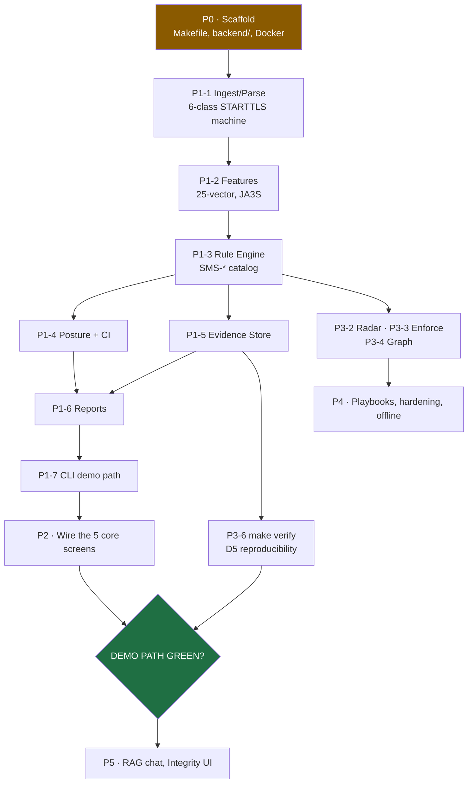

# SIH26159 SecureMailScope — 16. Forecast & Build Plan

> **Purpose:** a prediction of *how we get from today's state to a presentable product*,
> with sequencing, effort, the critical path, and the decisions that actually matter.
>
> This is a forecast, not a promise. Effort figures assume one competent engineer working
> full-time with the design docs as the spec. Written 29 Sep 2026, portal deadline 30 Sep.

---

## 1. Where we actually are

| Layer | State | % |
|---|---|---|
| Design contracts (14 docs) | Complete, cross-checked | **100%** |
| Test corpus | 5/5 generated + independently verified | **100%** |
| Frontend UI shell | 9 pages, type-checks, lints, but all mock data | **~55%** |
| Backend engine | **0 of 10 modules.** One Python file: the corpus generator | **0%** |
| Infra (Makefile, Docker, CI) | Absent | **0%** |
| Tests | None | **0%** |

**Diagnosis.** This is not a "80% done, needs polish" project. It is a **complete design +
a validated dataset + a beautiful mockup**, with the entire computational core unbuilt.
The UI looks finished, which is actively misleading — every number on screen is invented.

**The single most important thing to understand:** nothing in the UI can be demoed until
M1 (Ingest/Parse) and M3 (Rule Engine) exist, because the headline finding
(`SMS-ENF-002` on `stripped.pcap`) is produced by those two modules and nothing else.

---

## 2. The critical path

**The path to a demo is P0 → P1-1 → P1-2 → P1-3 → P1-4 → P1-5 → P1-6 → P1-7 → P2.**
Everything else — ML, radar, graph, RAG, hardening — is *after* the demo, not before it.

---

## 3. Phase-by-phase forecast

### P0 — Scaffold · 0.5–1 day

| Task | Do | Accept |
|---|---|---|
| P0-1 | `backend/` tree, `pyproject.toml`, `docker-compose.yml`, `Makefile`, `.gitignore`, `/api/v1/health` → `{"status":"ok"}`, 9-tab shell | `make up` healthy; `curl` returns ok; 9 tabs render |

**Toolchain blockers to clear first** — we are missing them today:
- `tshark` is **not installed** → `brew install wireshark` (M1 primary parser).
- `scapy` is **not installed** → part of `pyproject.toml`.
- Python is **3.14.7**, the spec says **3.12**. Either pin 3.12 in Docker, or accept 3.14
  and fix the spec. **Decide this in P0** — it affects every dependency pin.

### P1 — Core engine · 4–6 days ← *the whole project lives here*

| Task | Do | Accept |
|---|---|---|
| P1-1 | `parse_capture()`; tshark/pyshark + scapy fallback; **6-class STARTTLS state machine**; X.509 via `cryptography` | `stripped.pcap` → flows with correct `starttls_category` |
| P1-2 | `build_features()` → 25-vector, JA3S/JA4S, entropy, cipher-family/FS enums | vector length == 25 for every flow |
| P1-3 | `evaluate_rules()`; full `SMS-*` catalog with exact severities/CWEs/CVSS | `SMS-ENF-002` fires on `stripped.pcap`; `SMS-CIPH-001` on `weak-cipher.pcap` |
| P1-4 | `compute_posture()`; 6 weighted sub-scores → index, grade, **95% CI**, x509 conf floor 0.15 under TLS 1.3, tri-state | TLS-1.3 fixture yields **widened** CI + `NOT-OBSERVABLE` x509 |
| P1-5 | SQLite evidence store per `01` §3; report hash = SHA-256 over serialised findings + evidence | same session hashed twice → identical hash |
| P1-6 | `render_json` / `render_html` / `render_pdf` (WeasyPrint); report seal in header | PDF contains the SHA-256 seal string |
| P1-7 | `python -m app.cli score <pcap>` headless | runs <90 s, exit 0 |

> **Highest-risk task: P1-1.** The 6-class STARTTLS state machine is the intellectual
> centre of the product. Get it right and the demo falls out; get it wrong and every
> downstream finding is wrong. Budget extra time here.

### P2 — Wire the core screens · 2–3 days

The pages **already exist** — they need to stop lying.

| Task | Do | Accept |
|---|---|---|
| P2-1 | 9 routes, offline badge, session selector, `package_ver` chip | all 9 resolve; badge flips to `OFFLINE` when network blocked |
| P2-2 | Ingest: dropzone, folder mode, pipeline progress chips, session table | drop `stripped.pcap` → progress → "View findings →" |
| P2-3 | Posture: verdict hero, MX×service heatmap (**hatched for NOT-OBSERVABLE**), enforcement panel | hero renders `NN [lo–hi] · Grade · conf` |
| P2-4 | Graph: force graph, weakest-hop flags | ≥1 weakest hop flagged |
| P2-5 | Findings: risk-ranked table, filters, **evidence drawer** | drawer shows packet#, byte offset, rule ID, span hash |
| P2-6 | Reports: JSON/PDF/HTML + seal | PDF downloads with seal |
| P2-7 | WebSocket live feed | stage updates stream |

**Three rewrites are required, not optional:**
1. **Routes** — code serves `/dashboard/posture`; spec says `/posture`. Pick one. Ingest
   must be at `/`.
2. **Mock data** — `DashboardContext.tsx` holds a hardcoded `SCENARIOS` array referencing
   PCAPs that do not exist (`stripped-starttls-mitm.pcap`, `legacy-ciphers-sweet32.pcap`,
   `hardened-dane-mtasts.pcap`, `corp-perimeter-live-tap.pcap`). It must be replaced with
   real API calls. Faked progress (`pipelineStage = 9 // done`) is the worst offender.
3. **Charts** — no charting library is installed, though the spec mandates Recharts/D3.
   The graph is hand-drawn inline SVG. Either install Recharts or accept and document
   hand-rolled SVG.

### P3 — ML, radar, verify · 2–3 days

| Task | Do | Gate |
|---|---|---|
| P3-1 | ML sweep: Isolation Forest, autoencoder, GCM-nonce reuse, entropy, JA3S drift, GBDT + SHAP. **Flags only, never mutates a score** | proof that ML doesn't alter scores |
| P3-2 | **Downgrade Radar** (D1): 5 signals → Bayesian `P(strip)`, pinned cited priors | `P(strip) > 0.5` on a seeded fixture |
| P3-3 | **Enforcement consistency** (D3): DNS MTA-STS/DANE/TLS-RPT vs observed plaintext ratio | `VIOLATION` on a misconfigured domain |
| P3-4 | **Delivery graph backend** (D2): weakest-hop + traffic-weighted exposure | ≥1 weakest hop |
| P3-5 | Decay / change-point time series | changepoint flagged |
| P3-6 | **`make verify`** (D5): re-run pipeline, compare report hashes, exit 0/1 | **green** |
| P3-7 | **Incident Replay** (D6, promoted) — animated timeline, flagged moments, WebM | demoable |
| P3-8 | **Attack Lens** (D6, promoted) — likely-next-attack with drivers + "forecast not fact" | demoable |

### P4 — Hardening & LLM · 1–2 days

P4-1 playbooks via local Ollama (**every line must cite a `rule_id`**) · P4-2 hardening /
stay-ahead section · P4-3 offline polish · P4-4 demo assets.

**Non-negotiable:** playbooks must render with the LLM **disabled**, via a deterministic
template fallback (FR-37). If Ollama is not installed at the venue, the demo must not
degrade.

### P5 — Stretch · 1 day

P5-2 RAG chat (**must refuse** below a retrieval threshold; every claim cites finding IDs)
· P5-4 Integrity UI. Optional — never blocks the demo.

---

## 4. Effort summary

| Phase | Effort | Cumulative | Gate |
|---|---|---|---|
| P0 Scaffold | 0.5–1 d | 1 d | `make up` healthy |
| **P1 Core engine** | **4–6 d** | **5–7 d** | **CLI prints a posture score** |
| P2 Wire UI | 2–3 d | 7–10 d | **Demo path green in 3 clicks** |
| P3 ML/radar/verify | 2–3 d | 9–13 d | `make verify` green, Replay + Lens demoable |
| P4 Hardening | 1–2 d | 10–15 d | Offline green, playbook renders |
| P5 Stretch | 1 d | 11–16 d | optional |

**Total ≈ 11–16 engineer-days.** The P1 core engine is roughly **40% of the remaining work**
and is the only part that cannot be faked.

### Honest assessment against the deadline

With **1 day** left, the realistic outcome is P0 + a *subset* of P1, not a working product.
The way to maximise value under that constraint:

- **Cut in this order:** P5 (RAG, Integrity UI) → P4 (LLM playbooks, hardening) →
  P3 ML sweep (the rules already produce the score; ML only ranks) → P3-5 decay.
- **Never cut:** P0-1, P1-1, P1-3, P1-4, P1-5, P1-6, P1-7, P2-2, P2-5, and `make verify`.
  That set *is* the demo.

---

## 5. Decisions that actually matter

Three choices change the shape of the project. Everything else is execution.

### D-a. Version control topology — *unresolved, blocks reproducibility*

Today the only git repo is `platform/`. But `corpus/`, `AGENTS.md`, and `README.md` sit
**outside** it. The frozen PCAP fixtures and their pinned SHA-256 are therefore
**untracked** — so the D5 reproducibility guarantee is not actually pinned anywhere.

| Option | Effect |
|---|---|
| **Make `securemailscope/` the repo root** (recommended) | One repo holds docs, corpus, app. Best fit for "same capture ⇒ same hash". Requires absorbing `platform/`'s nested `.git`; 21 uncommitted entries there must be preserved first. |
| **Move `corpus/` into `platform/`** | Everything inside the existing repo. Matches the earlier "move docs into platform" instruction. Update Makefile paths + doc refs. |
| **Leave as-is** | Works locally; the reproducibility guarantee stays weak. |

### D-b. Python 3.12 vs 3.14

Spec pins 3.12; the machine has 3.14.7. Pin 3.12 in Docker (safest, matches every
tutorial) or amend the spec. Decide in P0 — retrofitting is painful.

### D-c. Route shape: `/posture` or `/dashboard/posture`

Code says the latter, spec says the former. The spec also puts **Ingest at `/`**, which
currently holds the marketing landing page. The demo opens on Ingest — this needs
resolving in P2-1, and it changes the landing page's home.

---

## 6. What we should *not* do

- **Do not keep polishing the mockup.** Every hour spent on landing-page visuals is an
  hour not spent on P1-3. The UI already looks finished; that is the trap.
- **Do not fake an acceptance check.** The build plan is explicit: if a check cannot run,
  mark it `BLOCKED` with the reason and move on. **Never fake a pass.**
- **Do not regenerate the TLS corpus fixtures casually.** They embed fresh handshake
  randomness, so regenerating changes their hashes and breaks `make verify` comparisons.
  They are frozen inputs.
- **Do not claim novelty for passivity, tri-state, drift, or evidence chains.** Those are
  table stakes; claiming them costs credibility with a judge who watched the other teams.
- **Do not let ML touch the score.** Deterministic-first is a hard constraint and also our
  defensible position.

---

## 7. First 10 tasks, in order

1. Resolve **D-a** (repo topology) and **D-b** (Python version).
2. Install `tshark`; create `backend/` + `pyproject.toml` + `Makefile` + `docker-compose.yml`.
3. `/api/v1/health` → `{"status":"ok"}`; `make up` green. *(P0-1)*
4. `parse_capture()` with tshark/pyshark + scapy fallback. *(P1-1a)*
5. **6-class STARTTLS state machine**; assert on `stripped.pcap`. *(P1-1b)*
6. X.509 decode via `cryptography`; assert RSA-1024 on `weak-key.pcap`. *(P1-1c)*
7. `build_features()` → 25-vector + JA3S. *(P1-2)*
8. `evaluate_rules()` — **ENF-001/002 + CIPH + KEY families first.** *(P1-3)*
9. `compute_posture()` with CI + tri-state. *(P1-4)*
10. SQLite evidence store + report hash. *(P1-5)*

> After task 10, `stripped.pcap` produces `SMS-ENF-002` and a real `58 [44–69] · D` posture
> line. **That is the demo.** Everything after it is depth.

---

*Cross-refs: `11-prd.md` (FR/NFR, success criteria) · `13-agent-build-plan.md` (task contracts) · `CONTEXT.md` (product context) · `15-landscape-vs-scope.md` (gap audit).*
