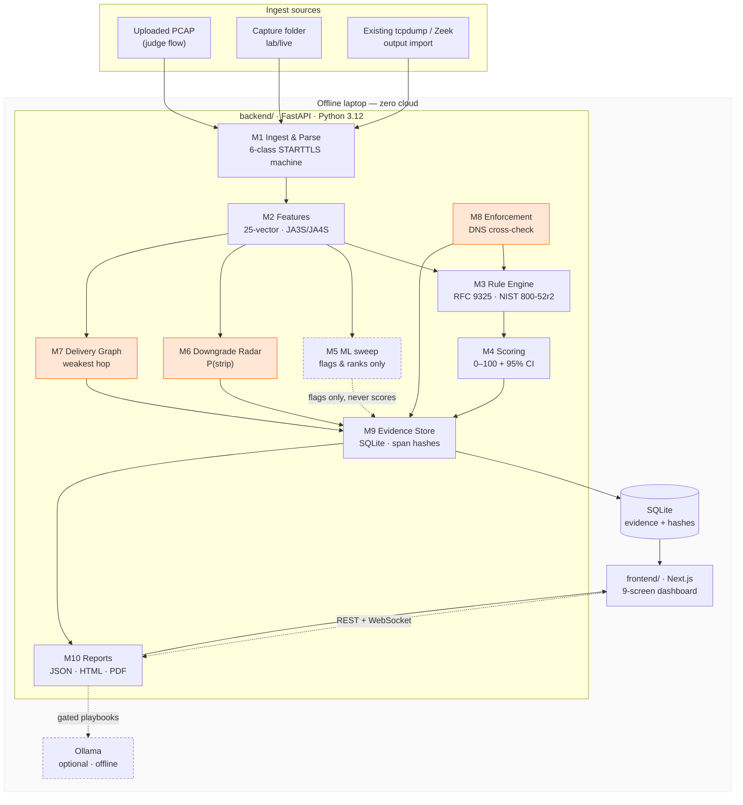
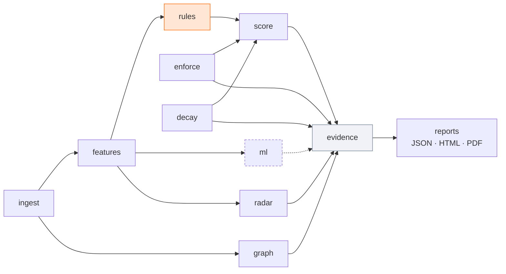
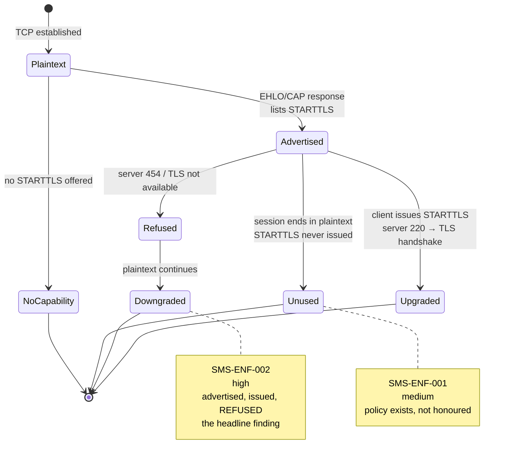
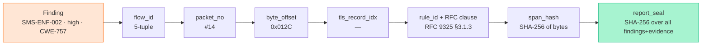
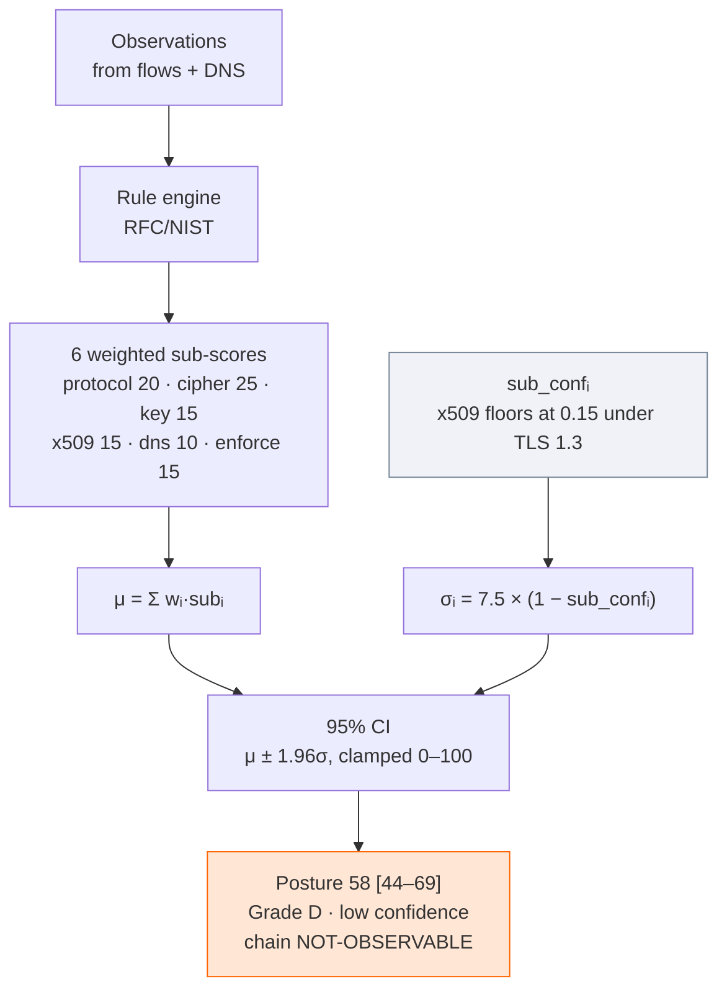

# SIH26159 SecureMailScope — 17. Visual Assets, Diagrams & Image Generation

> **Purpose:** everything visual — architecture diagrams you can render today, the brand
> system extracted from the live code, ready-to-paste image-generation prompts for the deck
> and marketing, and a storyboard for demo screenshots.
>
> Colours and fonts below are **read from the actual codebase**, not invented.

---

## 1. Brand system (extracted from `app/globals.css`)

| Token | Value | Use |
|---|---|---|
| `--color-primary` | `#ff6500` | Primary accent, CTAs, "risk" emphasis |
| `--color-primary-soft` | `#ffe6d5` | Tinted backgrounds, hover states |
| `--color-secondary` | `#44d5cc` | Secondary accent, "secure/verified" signal |
| `--color-heading` / `--color-ink` | `#0c0c0c` | Headings, body ink |
| `--color-body` | `#666666` | Paragraph text |
| `--color-muted` | `#758696` | Labels, metadata, "not observable" |
| `--color-surface` | `#ffffff` | Page background |
| `--color-surface-soft` | `#fafafa` | Card background |
| `--color-surface-alt` | `#f1f1f8` | Alternating / hatched rows |
| `--color-border` | `#ededed` | Hairlines |
| `--radius-pill` | `100px` | Fully-rounded chips |
| Font | **Inter Tight** → system stack | All UI |

**Status colours already in use**

| Meaning | Hex | Where |
|---|---|---|
| Critical / high severity | `#ef4444` · `#f87171` | Findings badges, worst-case |
| Pass / verified | `#10b981` · `#a7f3d0` | SECURE states, `make verify` green |
| Warning / medium | `#ff6500` · `#ffe6d5` | Primary accent, medium severity |
| Dark canvas (deck) | `#0F1420` · `#121826` | Slide backgrounds, hero |

**Semantic rule for diagrams:** orange = *attention/risk*, teal = *verified/secure*,
grey = *not observable*. Never use red for "not observable" — that would falsely imply a
failure where we only lack evidence.

---

## 2. Diagrams — Mermaid (render these first)

These render natively on **GitHub**, in **VS Code** (Markdown Preview Mermaid), **Obsidian**,
**Notion**, and **[mermaid.live](https://mermaid.live)**. Use them before generating any
raster image — they stay editable, diff cleanly, and never go stale in a way a PNG does.

### 2.1 System architecture



> **The one thing to annotate on this diagram:** the dashed line from M5 to M9.
> *ML may flag and rank. It may never change a score.* That is a hard product constraint,
> not an implementation detail — it is also our defensible engineering position.

### 2.2 Module dependency graph



**Invariant:** modules 3–8 write *only* through the evidence store. Every module is a pure
function of its inputs + `package_ver` — that is what makes the score reproducible.

### 2.3 The six-class STARTTLS state machine

The intellectual centre of the product. Most rivals do naive string-matching; this is why
our ENF findings are trustworthy.



| Class | Meaning | Rule fired |
|---|---|---|
| `UPGRADED` | STARTTLS issued, handshake completed | — |
| `REFUSED_THEN_PLAINTEXT` | Issued, server refused, plaintext continued | **`SMS-ENF-002`** (high) |
| `ADVERTISED_UNUSED` | Offered but never issued | **`SMS-ENF-001`** (medium) |
| `REPEAT_454` | 454 / "must issue" repeated >N times | `SMS-ENF-003` (medium) |
| `NO_CAPABILITY` | Never offered | (baseline) |
| `UNCLASSIFIED` | Truncated / ambiguous → `NOT-OBSERVABLE` | — |

### 2.4 Evidence chain — how a finding becomes defensible



This chain is the answer to *"can you defend this in audit or court?"* — a digital-forensics
examiner can walk from a finding to the exact bytes that produced it.

### 2.5 Scoring with confidence bounds



**The pitch point:** the number is never naked. A competitor that says "TLS score 82" cannot
tell you whether the X.509 chain was even visible. We can, and we say so.

### 2.6 D1–D6 differentiator map

```mermaid
flowchart TB
    ROOT["SecureMailScope capability set"]

    ROOT --> TS["Table stakes — BUILD FULLY, DO NOT CLAIM"]
    ROOT --> DF["D1–D6 — LEAD WITH THESE"]

    TS --> TS1["Passive PCAP analysis"]
    TS --> TS2["Packet-level evidence linkage"]
    TS --> TS3["Tri-state / not-observable"]
    TS --> TS4["Crypto drift / JA3S decay"]
    TS --> TS5["Isolation Forest · SHAP · JA3/JA4"]
    TS --> TS6["NIST / PCI mapping"]
    TS --> TS7["Live monitoring · lab scenarios"]
    TS --> TS8["JSON / PDF / HTML reports"]

    DF --> D1["D1 Downgrade Radar<br/>Bayesian P(strip) per MX<br/>5 signals · cited priors"]
    DF --> D2["D2 Delivery Graph<br/>cross-hop weakest hop<br/>traffic-weighted exposure"]
    DF --> D3["D3 Enforcement Consistency<br/>posted policy vs observed<br/>VIOLATION detector"]
    DF --> D4["D4 Confidence + Rubric<br/>95% CI on every score<br/>published · reproducible"]
    DF --> D5["D5 Tamper-evident<br/>make verify<br/>identical SHA-256"]
    DF --> D6["D6 Beyond-PS<br/>Incident Replay · Attack Lens<br/>RAG chat · Integrity · PQC"]

    style TS fill:#f1f1f8,stroke:#758696
    style DF fill:#ffe6d5,stroke:#ff6500
    style D1 fill:#fff5ec,stroke:#ff6500
    style D2 fill:#fff5ec,stroke:#ff6500
    style D3 fill:#fff5ec,stroke:#ff6500
    style D4 fill:#fff5ec,stroke:#ff6500
    style D5 fill:#fff5ec,stroke:#ff6500
    style D6 fill:#fff5ec,stroke:#ff6500
```



> Read this diagram **top-down in the pitch**: the grey column is everything rivals already
> do — we build it because the PS requires it, and we deliberately do not claim it. The
> orange column is the only place we claim novelty.

---

## 3. Rendering the diagrams

| Tool | How | Best for |
|---|---|---|
| **mermaid.live** | Paste, edit live, Export → PNG/SVG | Quick one-off export |
| **VS Code** | Markdown Preview → Mermaid supported | Editing diagrams in-doc |
| **GitHub** | Renders `.md` natively | Share the context doc as-is |
| **mmdc CLI** | `npm i -g @mermaid-js/mermaid-cli` | Batch export to SVG for the deck |

Batch-export every diagram to SVG for slide use:

```bash
# from the repo root
for f in context architecture modules starttls evidence scoring differentiators; do
  mmdc -i "diagrams/$f.mmd" -o "diagrams/$f.svg" -b transparent -w 1600
done
```

Export as **SVG**, not PNG — it stays sharp when projected and recolours cleanly if the
deck theme changes.

---

## 4. Image-generation prompts

For raster visuals (deck backgrounds, hero art, social). These are written to be pasted
into Midjourney / DALL·E / Stable Diffusion / Ideogram.

### 4.1 Global style suffix — append to every prompt

```
minimal technical infographic style, flat vector, dark navy background #0F1420,
orange accent #ff6500 and teal accent #44d5cc, thin geometric line work, no text,
no letters, no numbers, generous negative space, crisp edges, 16:9
```

> **Always include "no text, no letters, no numbers."** Diffusion models render garbled
> pseudo-text that must be cleaned up. Add labels in the deck tool, never in the image.

### 4.2 Hero / landing background

```
Abstract network topology visualization: glowing nodes connected by thin light trails
across a dark navy field, a few nodes highlighted in warm orange suggesting detected
weaknesses, subtle packet-flow ribbons moving left to right, depth of field, minimal,
no text, no letters, no numbers, 16:9
```

### 4.3 "Passive, never probing" concept

```
Split composition, left half: a magnifying glass observing a stream of small glowing
packets flowing past untouched, right half: a network node with a closed padlock and a
subtle shield outline. Flat vector, dark navy background, orange and teal accents,
minimal technical illustration, no text, no letters, no numbers, 16:9
```

### 4.4 "Where does mail leak" — cross-hop graph concept

```
Concentric network rings radiating from a single bright central node, some outer rings
glowing warm orange indicating weaker hops, thin connecting arcs between nodes with small
data pulses, isometric perspective, dark navy background, flat vector, orange and teal
accents, no text, no letters, no numbers, 16:9
```

### 4.5 Confidence interval / honest uncertainty

```
Abstract statistical visualization: a wide translucent uncertainty band narrowing toward
a central marker, faint data points scattered within the band, a dotted grey region
representing unknown data, dark navy background, orange center marker, teal band edges,
flat vector, minimal, no text, no letters, no numbers, 16:9
```

### 4.6 Incident Replay / timeline motif

```
Horizontal timeline ribbon with stacked event markers, one marker enlarged and glowing
orange as if a moment were selected, faint ghost frames trailing behind suggesting motion,
dark navy background, thin geometric line work, teal secondary accents, flat vector,
no text, no letters, no numbers, 21:9
```

### 4.7 Negative prompt

If your tool supports one:

```
text, letters, words, numbers, watermark, signature, logo, humans, faces, hands,
photorealistic, 3d render, glossy 3d, drop shadows, lens flare, cluttered, busy,
low contrast, grainy, jpeg artifacts
```

---

## 5. Iconography

Already in the codebase: **`lucide-react`**. Stay with it — do not add a second icon set.

| Concept | Icon | Note |
|---|---|---|
| Ingest / upload | `upload-cloud` | Primary action |
| Posture | `gauge` | Score + CI |
| Delivery graph | `share-2` / `git-fork` | Cross-hop |
| Findings | `shield-alert` | Risk-ranked table |
| Reports | `file-text` | JSON/PDF/HTML |
| Replay | `play-circle` / `rewind` | Promoted to core |
| RAG chat | `message-square` | Stretch |
| Attack Lens | `crosshair` | Promoted to core |
| Integrity | `shield-check` / `fingerprint` | Stretch |
| Air-gapped | `wifi-off` | Offline badge |
| NOT-OBSERVABLE | `help-circle` | Grey, never red |
| Verified | `check-circle-2` | Teal/green |

**Rules:** teal for verified, orange for attention, **grey for not-observable**, red only
for confirmed critical findings. Never use colour alone to convey state — pair with a
label or icon for accessibility.

---

## 6. Demo screenshot storyboard

Capture these in this order; they tell the whole story in six frames.

| # | Screen | What must be visible | Why it matters |
|---|---|---|---|
| 1 | **Ingest** `/` | `stripped.pcap` dropped, pipeline stage chips, session id + report hash | Proves it works offline, end to end |
| 2 | **Findings** `/findings` | `SMS-ENF-002` top row, high severity | **The money shot** — PS deliverable #1 |
| 3 | **Evidence drawer** | packet #14 · byte offset · rule ID · span hash | The "defensible in court" claim |
| 4 | **Posture** `/posture` | `58 [44–69] · Grade D · low confidence` with reason | D4 — the CI is the differentiator |
| 5 | **Graph + enforcement** | weakest hop flagged; `VIOLATION` panel | D2 + D3 |
| 6 | **Report PDF** | Header showing the SHA-256 seal | D5 |

**Capture hygiene:** use a clean viewport (1440×900), hide the macOS menu bar, use a dark
or light surface consistent with the deck, and make sure no `localhost:8000` chrome or
personal paths are visible. Unreadable screenshots lose more credibility than any claim.

---

## 7. Assets inventory

| Asset | Location | Status |
|---|---|---|
| Mermaid diagrams | this doc, §2 | Ready to render |
| Brand tokens | `app/globals.css` | Live in code |
| Marketing illustrations | `public/*.png`, `public/*.webp`, `public/*.svg` | Present (blog covers, hero, cards) |
| Lottie animations | `public/lottie/*.json` | Present (`anim_0`, `peoples`, `real-tracking`) |
| Logo | `public/raven_logo.svg`, `public/phish_logo.svg` | Present |
| Deck PDFs | `securemailscope/*.pdf` | Two versions present |
| OG image | `public/og-image.png` | Present |

> **Cleanup opportunity:** two deck PDFs and a `(1)` duplicate sit in the project root.
> Pick one canonical deck and remove the rest before submission — duplicate artefacts read
> as unfinished.

---

*Cross-refs: `CONTEXT.md` (product context) · `16-forecast-and-build-plan.md` (build sequence) · `app/globals.css` (live tokens).*
